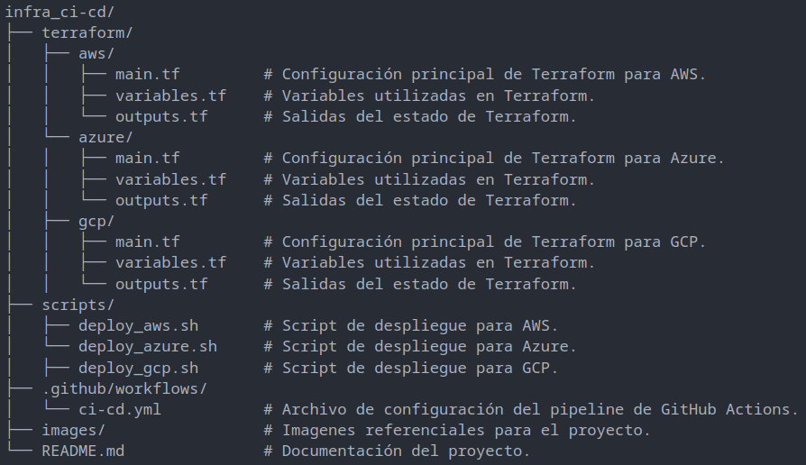

# Infra CI/CD Pipeline

Este repositorio contiene la infraestructura como código (IaC) y el pipeline de CI/CD para desplegar recursos en múltiples proveedores de nube (GCP, AWS, Azure). Utiliza Terraform para gestionar la infraestructura y GitHub Actions para automatizar el proceso de implementación.

---

## Tabla de Contenidos
[Descripción del Proyecto](#descripción-del-proyecto)
[Características Principales](#características-principales)
[Requisitos Previos](#requisitos-previos)
[Configuración del Proyecto](#configuración-del-proyecto)
[Estructura del Proyecto](#estructura-del-proyecto)
[Pipeline de CI/CD](#pipeline-de-cicd)
[Contribuciones](#contribuciones)
[Licencia](#licencia)

---

## Descripción del Proyecto

Este proyecto implementa un pipeline de CI/CD multi-nube utilizando GitHub Actions y Terraform. El objetivo es automatizar la creación y gestión de infraestructura en la nube, lo que permite desplegar recursos de manera consistente y escalable. Actualmente, el pipeline está configurado para trabajar con Google Cloud Platform (GCP), pero puede extenderse fácilmente a otros proveedores como AWS o Azure.

---

## Características Principales

- Multi-Nube: Compatible con GCP, AWS y Azure.
- Automatización Completa: Uso de GitHub Actions para ejecutar pipelines de CI/CD.
- Terraform: Gestión de infraestructura como código (IaC) para desplegar recursos de manera declarativa.
- Seguridad: Uso de secrets de GitHub Actions para proteger credenciales y configuraciones sensibles.
- Validación: Incluye pasos para validar credenciales y configuraciones antes de aplicar cambios.
- Escalabilidad: Diseñado para ser extensible y adaptable a diferentes entornos y proyectos.

---

## Requisitos Previos

- Cuenta en GitHub: Para configurar los secrets y ejecutar el pipeline.
- Proveedores de Nube:
- Credenciales de GCP (archivo JSON de cuenta de servicio).
- Opcionalmente, credenciales para AWS y Azure si planeas usar otros proveedores.
- CLI de GCP (gcloud) configurada.

---

## Configuración del Proyecto

1. Configuración de Secrets en GitHub Actions

    Asegúrate de agregar los siguientes secrets en Settings > Secrets and variables > Actions de tu repositorio de GitHub:

      - CLOUD_PROVIDER: Proveedor de nube (gcp, aws, azure).
      - GCP_CREDENTIALS_JSON: Credenciales de cuenta de servicio de GCP en formato JSON.
      - GCP_PROJECT_ID: ID del proyecto de GCP donde se crearán los recursos.
      - TF_VAR_REGION: Región de GCP donde se desplegarán los recursos.
      - TF_VAR_BUCKET_NAME: Nombre único del bucket de almacenamiento en GCP.

2. Ejecución del Pipeline

    El pipeline se ejecuta automáticamente cuando:

      - Se realiza un push al branch main.
      - Se activa manualmente desde la interfaz de GitHub Actions.

    Para ejecutarlo manualmente:

      - Ve a la pestaña Actions en tu repositorio de GitHub.
      - Selecciona el workflow CI/CD Pipeline for Multi-Cloud Deployment.
      - Haz clic en Run workflow.

---

## Estructura del proyecto

---

## Pipeline de CI/CD

    El pipeline sigue los siguientes pasos:

      - Checkout del Código: Clona el repositorio en el entorno de GitHub Actions.
      - Configuración de Terraform: Instala Terraform y configura el entorno.
      - Autenticación con GCP: Valida y autentica las credenciales de GCP.
      - Inicialización de Terraform: Inicializa el backend y descarga los plugins necesarios.
      - Planificación y Aplicación: Genera un plan de cambios y aplica la infraestructura.
      - Clonación del Repositorio del Proyecto: Clona el repositorio del proyecto principal.
      - Despliegue Final: Ejecuta scripts específicos según el proveedor de nube.

---

## Contribuciones
    ¡Las contribuciones son bienvenidas! Si deseas mejorar este proyecto, sigue estos pasos:

      - Haz un fork del repositorio.
      - Crea una nueva rama (git checkout -b feature/nueva-funcionalidad).
      - Realiza tus cambios y haz commit (git commit -m "Añadir nueva funcionalidad").
      - Sube tus cambios (git push origin feature/nueva-funcionalidad).
      - Abre un Pull Request.

---

## Licencia
    Este proyecto está bajo los términos de la licencia [MIT](LICENSE).